# **NEURAL NETWORKS**

## ÍNDICE

- [Descripción del Proyecto](#descripción-del-proyecto)
- [Estructura del Repositorio](#estructura-del-repositorio)
- [DataSet y Características](#dataset-y-características)
- [Preparación del Entorno](#preparación-del-entorno)
- [Comparativa entre Redes Simples](#comparativa-entre-redes-simples)
- [Comparativa entre Redes Convolucionales](#comparativa-entre-redes-convolucionales)
- [Detector de YOLO con pruebas en vídeo](#detector-de-yolo-con-pruebas-en-vídeo)
- [Fuentes y Documentación](#fuentes-y-documentación)

## DESCRIPCIÓN DEL PROYECTO

El proyecto consiste en la **creación y posterior comparación** entre diferentes redes neuronales de diferentes tipos con el objetivo de llevar a cabo la clasificación de un grupo de imágenes obtenidas a partir de un DataSet de señales de tráfico extraído de **Kaggle** ([pkdarabi/cardetection](https://www.kaggle.com/datasets/pkdarabi/cardetection)).

Se busca **comparar el rendimiento y desempeño** entre dos **redes neuronales simples** diferentes, además de comparar dos **CNNs** (*Convolutional Neural Networks*, Redes neuronales convolucionales) diferentes entre ellas y finalmente, comparar ambos tipos de redes para obtener una vista general y poder **sacar conclusiones al respecto**.

Como **última sección del proyecto**, se dispondrá de una Red entrenada haciendo uso del detector de imágenes [YOLO](https://docs.ultralytics.com/es/) con las mismas clases que se han entrenado los clasificadores anteriormente mencionados, esto es para obtener un resultado visual de detección de imagen en un vídeo con las clases de los clasificadores (*Computer Vision*) aunque sin uso más allá en la comparativa anteriormente mencionada entre los clasificadores basados en las redes simples y las CNNs.

Con el fin de mantener un **entorno controlado y equitativo** para los entrenamientos de las redes neuronales, se ha decidido entrenar todas las redes con la misma tarjeta gráfica, así como la misma cantidad de épocas de entrenamiento que se ha fijado a **50 épocas totales** (aunque se aplica *early stopping* por si se suceden muchas épocas sin mejora).

## ESTRUCTURA DEL REPOSITORIO

La estructura del repositorio consta de **1 carpeta raíz con los CSVs** (*Comma-Separated Values*) de los datos a usar, además de otras 3 carpetas principales que contienen el código de entrenamiento de las **Redes Neuronales** con sus correspondientes carpetas de resultados y utilidades:

Carpeta **CSVs** con sus contenidos:
```raw
> CSVs
    - labels_test.csv
    - labels_train.csv
    - labels_valid.csv
    - test_corregido.csv
    - train_corregido.csv
    - valid_corregido.csv
```

Carpeta **Network_Convolutional** con sus contenidos:
```raw
> Network_Convolutional
    > results
        - grafica_accuracy_custom.png
        - grafica_accuracy.png
        - grafica_juntos_custom.png
        - grafica_juntos.png
        - grafica_loss_custom.png
        - grafica_loss.png
        - matriz_confusion_custom.png
        - matriz_confusion.png
        - training_history_custom.csv
        - training_history.csv
        - (Entrenamientos .pth no subidos al repo para ahorrar espacio)
    - Network_Convolutional.ipynb
    - Network_Convolutional2.ipynb
```

Carpeta **Network_Simple** con sus contenidos:
```raw
> Network_Simple
    > results
        - grafica_accuracy_simple1.png
        - grafica_accuracy_simple2.png
        - grafica_juntos_simple1.png
        - grafica_juntos_simple2.png
        - grafica_loss_simple1.png
        - grafica_loss_simple2.png
        - matriz_confusion_simple1.png
        - matriz.confusion_simple2.png
        - training_history_simple1.csv
        - training_history_simple2.csv
        - (Entrenamientos .pth no subidos al repo para ahorrar espacio)
    - Network_Simple.ipynb
    - Network_Simple2.ipynb
```

Carpeta **Network_YOLO** con sus contenidos:
```raw
> Network_YOLO
    > outputs
        - tracking_result_YOLO.mp4
    > Resources
        - test.mp4
    > runs
        > detect
            > val
                - BoxF1_curve.png
                - BoxP_curve.png
                - BoxPR_curve.png
                - BoxR_curve.png
                - confusion_matrix_normalized.png
                - confusion_matrix.png
                - predictions.json
                - (Valores de labels en los batch)
        > train_custom
            > exp1
                > weights
                    - best.pt
                    - last.pt
                - args.yaml
                - BoxF1_curve.png
                - BoxP_curve.png
                - BoxPR_curve.png
                - BoxR_curve.png
                - confusion_matrix_normalized.png
                - confusion_matrix.png
                - labels.jpg
                - results.csv
                - results.png
                - (Valores de labels en los batch)
    - data.yaml
    - tracking_results.csv
    - YOLO_Network.ipynb
    - YOLO.mp3
    - yolo11m.pt
```

## DATASET Y CARACTERÍSTICAS

Con el propósito de entrenar las redes neuronales se ha hecho uso, como se mencionó en la [descripción del proyecto](#descripción-del-proyecto) de un DataSet sacado directamente de Kaggle, dicho dataset está preparado para su uso en tareas de *Computer Vision* haciendo uso de [YOLO](https://docs.ultralytics.com/es/) (Véase [Detector de YOLO con pruebas en vídeo](#detector-de-yolo-con-pruebas-en-vídeo)). El DataSet a utilizar es el siguiente:

- https://www.kaggle.com/datasets/pkdarabi/cardetection

El mencionado DataSet cuenta con 3 directorios llamados train, test y valid y cada uno de ellos posee una carpeta para las imágenes y otra para los *labels* en [formato YOLO](https://docs.ultralytics.com/datasets/detect/) y con un total de 15 clases:

- **Green Light** 
- **Red Light** 
- **Speed Limit 10** -> Esta se elimina (Véase [Preparación del Entorno](#preparación-del-entorno))
- **Speed Limit 100**
- **Speed Limit 110**
- **Speed Limit 120**
- **Speed Limit 20**
- **Speed Limit 30**
- **Speed Limit 40**
- **Speed Limit 50**
- **Speed Limit 60**
- **Speed Limit 70**
- **Speed Limit 80**
- **Speed Limit 90**
- **Stop**

Las **imágenes del DataSet** cuentan con un tamaño de **416x416 píxeles** y con una división de imágenes dentro de sus carpetas correspondientes y de manera total que se puede observar en la siguiente tabla:

| Label | Test Images | Train Images | Valid Images | Total Images |
| :---: | :---------: | :----------: | :----------: | :----------: |
|   0   |     110     |     542      |      122     |      774     |
|   1   |      94     |     585      |      108     |      787     |
|   2   |       3     |      19      |      0       |      22      |
|   3   |      46     |     267      |      52      |      365     |
|   4   |      21     |     101      |      17      |      139     |
|   5   |      44     |     252      |      60      |      356     |
|   6   |      46     |     285      |      56      |      387     |
|   7   |      60     |     334      |      74      |      468     |
|   8   |      53     |     235      |      55      |      343     |
|   9   |      50     |     283      |      71      |      404     |
|  10   |      45     |     301      |      76      |      422     |
|  11   |      53     |     318      |      78      |      449     |
|  12   |      61     |     323      |      56      |      440     |
|  13   |      34     |     168      |      38      |      240     |
|  14   |      50     |     285      |      81      |      416     |


## PREPARACIÓN DEL ENTORNO

Para la realización del proyecto, primeramente se han de descargar una serie de paquetes, requisitos y dependencias, para ello, y con el propósito de aislar las descargas y por consiguiente evitar incompatibilidades con otros paquetes, se ejecuta el siguiente **Script** desde **Anaconda Prompt** para la creación de un *environment* especializado para el proyecto.

```bash
# Creación del environment de Anaconda
conda create --name NN python=3.11.5
conda activate NN

# Para entrenar con GPU NVIDIA
pip install torch torchvision torchaudio --index-url https://download.pytorch.org/whl/cu121

# Resto de dependencias del proyecto
pip install pandas 
pip install numpy
pip install matplotlib 
pip install seaborn
pip install scikit-learn
pip install tqdm
pip install pillow
pip install kagglehub
pip install lapx
pip install ultralytics
```

De manera adicional, **se han de tratar los datos del DataSet** descargado dado que la clase de **índice 2 tiene muy pocas imágenes**, incluso no teniendo ninguna imagen dentro del conjunto de imagenes de validación lo que **ocasiona problemas** durante el entrenamiento y genera confusión, empeorando así el desempeño de las propias redes neuronales.

Para limpiar la clase en cuestión, el repositorio cuenta con un documento en la raíz llamado `new_csv.py`que contiene el siguiente **Script** de borrado:

```python
import csv

def procesar_csv(archivo_entrada, archivo_salida):
    print(f"\n--- Iniciando procesamiento de: '{archivo_entrada}' ---")   
    filas_eliminadas = 0
    filas_modificadas = 0
    filas_totales_escritas = 0

    try:
        with open(archivo_entrada, mode='r', newline='') as infile, \
             open(archivo_salida, mode='w', newline='') as outfile:
            reader = csv.reader(infile)
            writer = csv.writer(outfile)

            try:
                header = next(reader)
                writer.writerow(header)
            except StopIteration:
                print(f"Error: El archivo '{archivo_entrada}' está vacío.")
                return

            for row in reader:
                if not row:
                    continue
                try:
                    clase_index = int(row[1])                 
                    if clase_index == 2:
                        filas_eliminadas += 1
                        continue
                    elif clase_index > 2:
                        clase_index -= 1
                        filas_modificadas += 1
                        row[1] = str(clase_index) 
                    writer.writerow(row)
                    filas_totales_escritas += 1

                except ValueError:
                    print(f"Advertencia: Se omitió una fila mal formada (índice no numérico): {row}")
                except IndexError:
                    print(f"Advertencia: Se omitió una fila mal formada (faltan columnas): {row}")

        print(f"Resultados guardados en: '{archivo_salida}'")
        print(f"Filas eliminadas: {filas_eliminadas}")
        print(f"Filas re-mapeadas: {filas_modificadas}")
        print(f"Total de filas escritas: {filas_totales_escritas}")

    except FileNotFoundError:
        print(f"Error: No se encontró el archivo de entrada '{archivo_entrada}'.")
    except Exception as e:
        print(f"Ocurrió un error inesperado con '{archivo_entrada}': {e}")

archivos_a_procesar = [
    ('./CSVs/labels_train.csv', './CSVs/train_corregido.csv'),
    ('./CSVs/labels_valid.csv', './CSVs/valid_corregido.csv'),
    ('./CSVs/labels_test.csv', './CSVs/test_corregido.csv')
]
print("Iniciando el procesamiento de todos los archivos...")

for entrada, salida in archivos_a_procesar:
    procesar_csv(entrada, salida)

print("\n--- ¡Proceso de todos los archivos completado! ---")
```
Adicionalmente y por simplicidad, se ha decidido agregar el anterior **Script** a cada uno de los *Jupyter Notebooks* de cada red neuronal.

Tras el **Script** de limpiado, el estado del DataSet con el que se va a trabajar es el siguiente:

| Label | Test Images | Train Images | Valid Images | Total Images |
| :---: | :---------: | :----------: | :----------: | :----------: |
|   0   |     110     |      542     |      122     |      774     |
|   1   |      94     |      585     |      108     |      787     |
|   2   |      46     |      267     |      52      |      365     |
|   3   |      21     |      101     |      17      |      139     |
|   4   |      44     |      252     |      60      |      356     |
|   5   |      46     |      285     |      56      |      387     |
|   6   |      60     |      334     |      74      |      468     |
|   7   |      53     |      235     |      55      |      343     |
|   8   |      50     |      283     |      71      |      404     |
|   9   |      45     |      301     |      76      |      422     |
|   10  |      53     |      318     |      78      |      449     |
|   11  |      61     |      323     |      56      |      440     |
|   12  |      34     |      168     |      38      |      240     |
|   13  |      50     |      285     |      81      |      416     |

Nótese que ahora hay **una fila menos**, esto es porque el **Script** borra el rastro de la anterior clase de índice 2 y reestructura todos los datos para que los *labels* estén ordenados.

## COMPARATIVA ENTRE REDES SIMPLES

Se han creado 2 redes Simples haciendo uso de *[PyTorch](https://pytorch.org)* con sus respectivas cualidades y características para comprobar la variación en la calidad de las mismas.

La primera de las Redes Neuronales Simples ([Network_Simple.ipynb](./Network_Simple/Network_Simple.ipynb)) aplica el siguiente tratado de imágenes:

- Se define el tamaño de las imágenes: **416x416 píxeles**.

- Se convierten las imágenes de entrenamiento a **escala de grises** pero se mantienen los 3 canales de salida para que el formato numérico sea **idéntico a una imagen a color** y luego se **normaliza el valor** de los píxeles entre -1 y 1.

- La transformación de las imágenes de validación solo redimensiona y normaliza sin pasar a escala de grises.

En cuanto a la clase DataSet (necesaria para entrenar redes con *[PyTorch](https://pytorch.org)*) realiza lo siguiente:

- Busca la imagen en el disco.
- Si la imagen está corrupta, devuelve una imagen negra para evitar que el entrenamiento falle.
- Busca la etiqueta (clase) en el DataFrame agrupado.
- Aplica las transformaciones y devuelve el par `(imagen, etiqueta)`.

A continuación y en otro fragmento, se aplica al conjunto de datos la modificación de los datos mencionados antes en el **Script** de eliminación de la clase de índice 2 (Véase [Preaparación del Entorno](#preparación-del-entorno) y/o el [Script](new_csv.py)).

Con los preparativos previos, la definición del **Modelo SimpleNN** que define el cerebro artificial de la arquitectura queda de la siguiente manera:

```python
class SimpleNN(nn.Module):
    def __init__(self, num_classes=14):
        super(SimpleNN, self).__init__()
        
        # Cálculo automático del tamaño aplanado
        self.flatten_size = 3 * 416 * 416 
        
        # Arquitectura Piramidal (Reduciendo progresivamente)
        self.fc1 = nn.Linear(self.flatten_size, 512) 
        self.bn1 = nn.BatchNorm1d(512) # BatchNorm ayuda mucho en redes simples profundas
        
        self.fc2 = nn.Linear(512, 256)
        self.bn2 = nn.BatchNorm1d(256)
        
        self.fc3 = nn.Linear(256, 128)
        self.bn3 = nn.BatchNorm1d(128)
        
        self.out = nn.Linear(128, num_classes)
        
        self.dropout = nn.Dropout(0.5) # Dropout para evitar memorización

    def forward(self, x):
        # Aplanar
        x = x.view(x.size(0), -1) 
        
        # Capa 1
        x = F.relu(self.bn1(self.fc1(x)))
        x = self.dropout(x)
        
        # Capa 2
        x = F.relu(self.bn2(self.fc2(x)))
        x = self.dropout(x)
        
        # Capa 3
        x = F.relu(self.bn3(self.fc3(x)))
        
        # Salida
        x = self.out(x)
        return x

def create_simple_model(num_classes=14):
    model = SimpleNN(num_classes=num_classes)
    print(f"Modelo SimpleNN (416x416) creado.")
    print(f"Neuronas de entrada: {model.flatten_size}")
    return model
```

Las cualidades de la red que define el fragmento de código anterior son las siguientes:

- **Tipo de Red:** La Red es un **Perceptrón Multicapa** (MLP) o Red Neuronal Densa.

- Cálculo de neuronas de entrada: se realiza un `self.flatten_size`para calcular el número de neuronas de entradas son necesarias siguiendo el siguiente cálculo:

    $$
    \text{Neuronas Entrada} = \text{3 canales} \times (416*416)
    $$

- Número de capas embudo: La arquitectura va comprimiendo el número de neuronas en sucesivas capas:

    - **Entrada masiva de datos:** Empieza con aproximadamente 519k neuronas.
    - **Capa 1:** Se reduce el número de neuronas de manera drástica a 512.
    - **Capa 2:** Se reduce a 256 neuronas.
    - **Capa 3:** Se reduce a 128 neuronas.
    - **Salida:** Salen 14 neuronas (una por cada clase definida por el conjunto de datos).

- Entre cada una de las capas embudo se aplica también una regularización con dos valores importantes:

    - `BatchNorm1d`: Normaliza los datos dentro de la red para estabilizar el aprendizaje.
    - `Dropout(0.5)`: Apaga aleatoriamente el 50% de las neuronas durante el entrenamiento para evitar un **_overfitting_** (memorización) muy brusco por parte de la red.

- La última parte relevante a comentar en la definición de la arquitectura de la red neuronal es el método `forward`, que aunque no pertenece a la arquitectura en sí, es necesaria dado que realiza lo siguiente:

    - Se realiza un proceso de **_flattening_** o aplanamiento en el que entra un Batch (lote) de imágenes que **PyTorch** ve como un tensor 4D dado a que en las redes neuronales "densas" como la que se ha creado no existe una tendencia a lo ancho o a lo alto sino que solo entienden de listas largas de números. Esta línea aplana las dimensiones de la imagen

    - A cada capa se aplica una función de activación no lineal (ReLu) que convierte todos los números negativos en 0 deja pasar a los positivos permitiendo a la red aprender formas complejas y no solo las líneas rectas.

    - La salida NO tiene una función *Softmax*, se queda como números crudos (negativos o positivos) porque más adelante se usa `nn.CrossEntropyLoss` que aplica de manera interna un *Softmax* por lo que, si se pone el *Softmax* en esta salida se rompería el entrenamiento más adelante.

Una vez creada la definición de la arquitectura, se busca el *device* disponible para intentar usar una gráfica CUDA si la hubiese, y posteriormente se muestra el *summary* del modelo cargado en el dispositivo:

```raw
--- Usando GPU: NVIDIA GeForce RTX 3060 Ti ---

----------------------------------------------------------------
        Layer (type)               Output Shape         Param #
================================================================
            Linear-1                  [-1, 512]     265,814,528
       BatchNorm1d-2                  [-1, 512]           1,024
           Dropout-3                  [-1, 512]               0
            Linear-4                  [-1, 256]         131,328
       BatchNorm1d-5                  [-1, 256]             512
           Dropout-6                  [-1, 256]               0
            Linear-7                  [-1, 128]          32,896
       BatchNorm1d-8                  [-1, 128]             256
            Linear-9                   [-1, 14]           1,806
================================================================
Total params: 265,982,350
Trainable params: 265,982,350
Non-trainable params: 0
----------------------------------------------------------------
Input size (MB): 1.98
Forward/backward pass size (MB): 0.02
Params size (MB): 1014.64
Estimated Total Size (MB): 1016.64
----------------------------------------------------------------
```

Tras todo lo anterior, se empieza con el bucle de entrenamiento. Como se ha mencionado anteriormente, todos los entrenamientos realizados han ejecutado exactamente 50 épocas, en el caso del entrenamiento de esta red simple.

Los hiperparámetros han sido:

- **50 épocas** (aunque puede parar antes por la paciencia)
- **_Learning Rate_** (Tasa de aprendizaje) del 0.001.
- **Paciencia** de 10 épocas para detener el entrenamiento en caso de no haber mejora.

El Optimizador y la función de pérdida:

- `CrossEntropyLoss`: La fórmula estándar para medir el error en clasificación múltiple (Para más información véase: [CrossEntropyLoss, PyTorch](https://docs.pytorch.org/docs/stable/generated/torch.nn.CrossEntropyLoss.html)).
- `Adam`: El algoritmo que actualiza los pesos de la red para reducir el error (Para más información véase: [Adam, PyTorch](https://docs.pytorch.org/docs/stable/generated/torch.optim.Adam.html))
- `ReduceLROnPlateau`: En el caso de que la red deje de mejorar, reduce el **_Learning Rate_** para intentar encontrar un mínimo más preciso (Para más información véase: [ReduceLROnPlateau, PyTorch](https://docs.pytorch.org/docs/stable/generated/torch.optim.lr_scheduler.ReduceLROnPlateau.html)). 

El bucle para cada época:

- Fase de *Train*: La red predice, calcula el error y hace backward (retroprogramación) para ajustar pesos.

- Fase de *Validation*: La red predice sobre datos que nunca ha visto sin aprender de ellos solo para medir su rendimiento real.

- **_Early Stopping_**: Si la precisión en la validación no mejora durante 10 épocas seguidas, el entrenamietno se detiene de manera prematura para ahorrar tiempo y evitar sobreajuste.

En cuanto a los resultados del entrenamiento, se guardan dentro de un CSV y después, haciendo uso de dichos datos, se reconstruye un gráfico de la función de pérdida y de la precisión obtenida tal que:

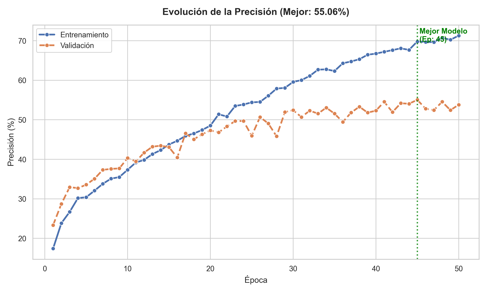
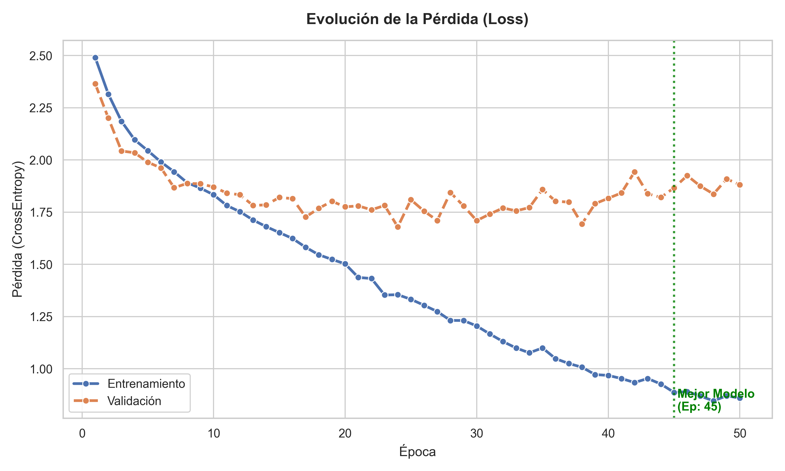

En las gráficas se puede apreciar como al principio la red entrena bien pero a partir de aproximadamente la época 20 empieza un **_overfitting_** o memorización que impide que la red siga aprendiendo, no obstante los datos del accuracy obtenidos, para una red neuronal simple son previsibles dado que suelen oscilar entre un 40-50% de precisión.

En cuanto a la evaluación del modelo total y la matriz de confusión, los datos obtenidos del modelo son los siguientes:

### **Resultados de la evaluación (Test Simple-1)**

| Clase | Precision | Recall | F1-score | Support |
|:-----:|:---------:|:------:|:------:|:-------:|
| 0  | 0.46 | 0.28 | 0.35 | 69 |
| 1  | 0.40 | 0.61 | 0.48 | 56 |
| 2  | 0.29 | 0.44 | 0.35 | 41 |
| 3  | 0.29 | 0.10 | 0.15 | 20 |
| 4  | 0.42 | 0.49 | 0.45 | 35 |
| 5  | 0.86 | 0.96 | 0.91 | 45 |
| 6  | 0.51 | 0.52 | 0.51 | 56 |
| 7  | 0.20 | 0.26 | 0.22 | 47 |
| 8  | 0.50 | 0.44 | 0.47 | 45 |
| 9  | 0.52 | 0.53 | 0.53 | 43 |
| 10 | 0.70 | 0.55 | 0.62 | 47 |
| 11 | 0.44 | 0.36 | 0.40 | 55 |
| 12 | 0.17 | 0.17 | 0.17 | 30 |
| 13 | 0.89 | 0.68 | 0.77 | 47 |
| **Accuracy** | — | — | **0.47** | **636** |
| **Macro avg** | 0.48 | 0.46 | 0.46 | 636 |
| **Weighted avg** | 0.49 | 0.47 | 0.47 | 636 |

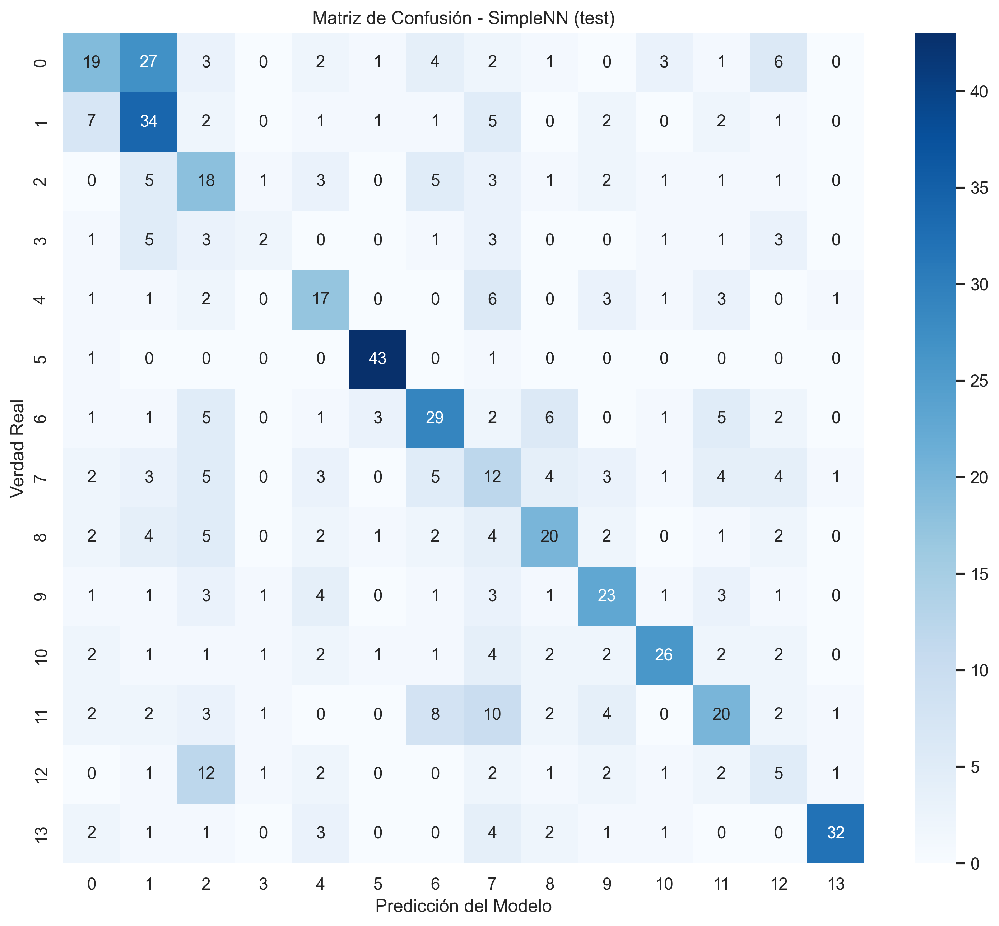

En cuanto a la segunda red neuronal simple, los cambios respecto a la red neuronal simple anterior son:

- La carga de datos de entrenamiento a la que se le aplican en esta red muchos parámetros para complicar el conjunto:

```python
train_transform = transforms.Compose([
    transforms.Resize(IMAGE_SIZE),
    transforms.RandomHorizontalFlip(p=0.5), 
    transforms.RandomRotation(degrees=15), 
    transforms.ColorJitter(brightness=0.2, contrast=0.2),
    transforms.Grayscale(num_output_channels=3),
    transforms.ToTensor(),
    transforms.Normalize((0.5, 0.5, 0.5), (0.5, 0.5, 0.5)),
])
```

- La definición de la arquitectura del proyecto es diferente, en este caso es tal que:

```python
class SimpleNN(nn.Module):
    def __init__(self, num_classes=14):
        super(SimpleNN, self).__init__()
        
        # Cálculo automático del tamaño aplanado
        self.flatten_size = 3 * 416 * 416 
        
        # Arquitectura Piramidal (Reduciendo progresivamente)
        self.fc1 = nn.Linear(self.flatten_size, 512)    # Bajar a 128 para controlar entrada
        self.bn1 = nn.BatchNorm1d(512)
        
        self.fc2 = nn.Linear(512, 256)                  # Cuello de botella invertido (ayuda a mezclar features)
        self.bn2 = nn.BatchNorm1d(256)
        
        self.fc3 = nn.Linear(256, 128)
        self.bn3 = nn.BatchNorm1d(128)

        self.fc4 = nn.Linear(128, 64)
        self.bn4 = nn.BatchNorm1d(64)
        
        self.out = nn.Linear(64, num_classes)
        
        self.dropout = nn.Dropout(0.5) # Dropout para evitar memorización

    def forward(self, x):
        # Aplanar
        x = x.view(x.size(0), -1) 
        
        # Capa 1
        x = F.relu(self.bn1(self.fc1(x)))
        x = self.dropout(x)
        
        # Capa 2
        x = F.relu(self.bn2(self.fc2(x)))
        x = self.dropout(x)
        
        # Capa 3
        x = F.relu(self.bn3(self.fc3(x)))
        x = self.dropout(x)

        # Capa 4
        x = F.relu(self.bn4(self.fc4(x)))
        
        # Salida
        x = self.out(x)
        return x

def create_simple_model(num_classes=14):
    model = SimpleNN(num_classes=num_classes)
    print(f"Modelo SimpleNN (416x416) creado.")
    print(f"Neuronas de entrada: {model.flatten_size}")
    return model
```

En donde el cambio principal reside en que tiene una capa extra que la red simple anteriormente mencionada.

En cuanto al *summary* de la arquitectura cargada dentro de la tarjeta gráfica para el entrenamiento (mismo procedimiento que el explicado en la primera red simple), se tiene lo siguiente:

```raw
--- Usando GPU: NVIDIA GeForce RTX 3060 Ti ---

----------------------------------------------------------------
        Layer (type)               Output Shape         Param #
================================================================
            Linear-1                  [-1, 512]     265,814,528
       BatchNorm1d-2                  [-1, 512]           1,024
           Dropout-3                  [-1, 512]               0
            Linear-4                  [-1, 256]         131,328
       BatchNorm1d-5                  [-1, 256]             512
           Dropout-6                  [-1, 256]               0
            Linear-7                  [-1, 128]          32,896
       BatchNorm1d-8                  [-1, 128]             256
           Dropout-9                  [-1, 128]               0
           Linear-10                   [-1, 64]           8,256
      BatchNorm1d-11                   [-1, 64]             128
           Linear-12                   [-1, 14]             910
================================================================
Total params: 265,989,838
Trainable params: 265,989,838
Non-trainable params: 0
----------------------------------------------------------------
Input size (MB): 1.98
Forward/backward pass size (MB): 0.02
Params size (MB): 1014.67
Estimated Total Size (MB): 1016.67
----------------------------------------------------------------
```

En cuanto al bucle de entrenamiento, se diferencia al de la primera red neuronal en los siguientes puntos:

- `AdamW`: Utiliza este optimizador que además posee un parámetro llamado `WEIGHT_DECAY` que añade una penalización matemática si los pesos de la red crecen demasiado, obligando a la red a mantener sus conexiones "simples" (Para más información véase: [AdamW, PyTorch](https://docs.pytorch.org/docs/stable/generated/torch.optim.AdamW.html))

- A la función de pérdida `nn.CrossEntropyLoss`se le agrega un *label_smothing* para que no tenga que estar al 100% seguro para clasificar una imagen dentro de una clase por lo que en este caso concreto, clasifica con un 90% de seguridad.

- **_Gradient Clipping_**: Aplica un freno de seguridad, revisa si el peso es demasiado grande y si lo es recorta su tamaño a un máximo de 1.0 para procurar un aprendizaje suave y estable.

Tras todo lo mencionado, la tabla de diferencias entre ambos procesos de entrenamiento queda de la siguiente manera:

| Característica | Primera Red Neuronal | Segunda Red Neuronal | Efecto en la Red |
| :--- | :--- | :--- | :--- |
| **Optimizador** | `Adam` | `AdamW` + `Weight Decay` | El segundo evita mejor la memorización (*overfitting*). |
| **Objetivo (Loss)** | Estricto (0 vs 1) | Suavizado (0.1 vs 0.9) | El segundo generaliza mejor ante datos nuevos. |
| **Estabilidad** | Ninguna | `Gradient Clipping` | El segundo evita "explosiones" de error que rompen el entrenamiento. |
| **Archivos** | `_simple1` | `_simple2` | Permite guardar historiales de experimentos distintos. |

En cuanto a los resultados del entrenamiento, se guardan y procesan de la misma manera exacta que en la primera red neuronal, y las gráficas con los resultados obtenidos son las siguientes:

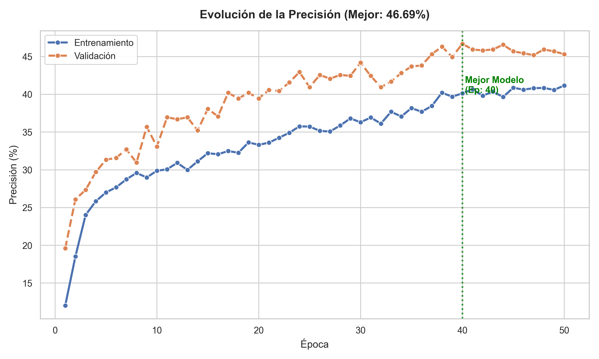
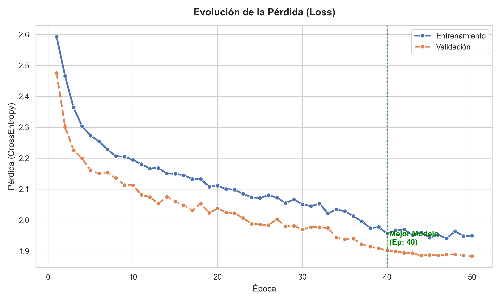

Las gráficas dejan ver un suceso extraño que no suele ocurrir llamado **_under-fitting_** en donde las pruebas de validación muestran mejor precisión que el propio entrenamiento, esto seguramente ha sucedido debido a la dificultad extra y las modificaciones aplicadas al conjunto de entrenamiento a la hora de cargarlo.

En cuanto a la evaluación del modelo total y la matriz de confusión, los datos obtenidos del modelo son los siguientes:

### **Resultados de la evaluación (Test Simple-2)**

| Clase | Precision | Recall | F1-score | Support |
|:-----:|:---------:|:------:|:--------:|:-------:|
| 0  | 0.45 | 0.48 | 0.46 | 69 |
| 1  | 0.40 | 0.57 | 0.47 | 56 |
| 2  | 0.39 | 0.34 | 0.36 | 41 |
| 3  | 0.00 | 0.00 | 0.00 | 20 |
| 4  | 0.46 | 0.31 | 0.37 | 35 |
| 5  | 0.74 | 0.96 | 0.83 | 45 |
| 6  | 0.35 | 0.46 | 0.40 | 56 |
| 7  | 0.21 | 0.23 | 0.22 | 47 |
| 8  | 0.45 | 0.20 | 0.28 | 45 |
| 9  | 0.51 | 0.42 | 0.46 | 43 |
| 10 | 0.59 | 0.55 | 0.57 | 47 |
| 11 | 0.22 | 0.40 | 0.28 | 55 |
| 12 | 0.00 | 0.00 | 0.00 | 30 |
| 13 | 0.87 | 0.70 | 0.78 | 47 |
| **Accuracy** | — | — | **0.44** | **636** |
| **Macro avg** | 0.40 | 0.40 | 0.39 | 636 |
| **Weighted avg** | 0.43 | 0.44 | 0.42 | 636 |

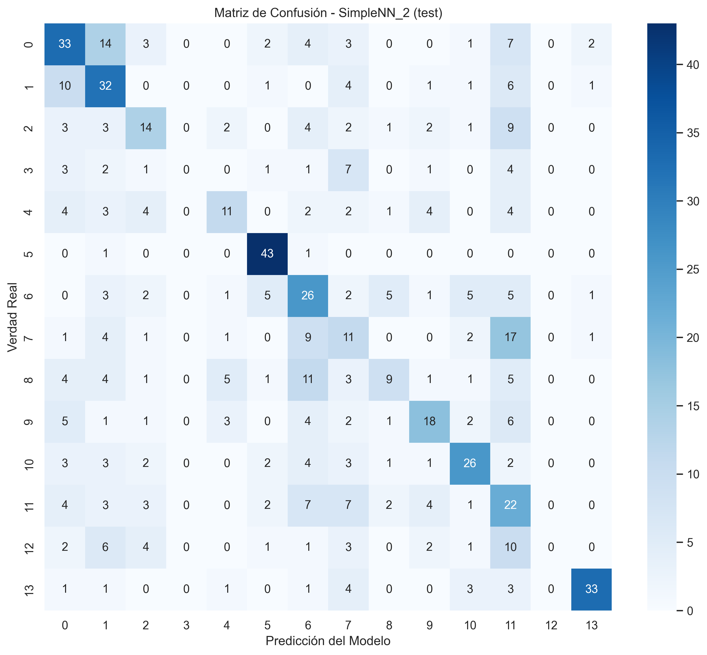

Tras analizar los datos de los resultados, se puede apreciar que pese al todo el preprocesado de datos y las modificaciones futuras, se consigue en la segunda red neuronal simple un peor desempeño global que en la primera red neuronal simple.

Las gráficas de comparación entre las redes quedan tal que:

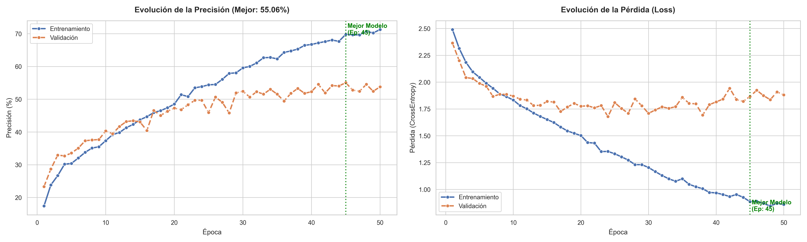
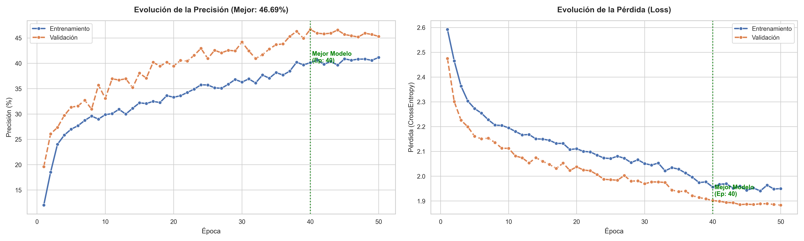

## COMPARATIVA ENTRE REDES CONVOLUCIONALES

En las redes neuronales convolucionales, todo el proceso del principio de la carga de datos está calcado al de las redes simples, en este caso, la [primera red convolucional](./Network_Convolutional/Network_Convolutional.ipynb) usa la carga de datos de la primera red convolucional simple.

Esta Red Convolucional se caracteriza por utilizar **_Transfer Learning_**, concretamente por cargar un modelo `ResNet50`que carga una CNN con 50 capas preentrenadas. De manera adicional, dicha red no se carga con los pesos aleatorios sino con la memoria de haber visto 1.2 millones de imágenes de *ImageNet* por lo que ya sabe perfectamente lo que es una curva, una textura metálica, un coche, etc. Para más información acerca de la `ResNet` véase: [ResNet, PyTorch](https://docs.pytorch.org/vision/main/models/generated/torchvision.models.resnet50.html).

La definición de la arquitectura de la red neuronal convolucional con el `ResNet` es congelar la actualización de los pesos de todas las capas (*freezing*) y en la última capa que es una *Fully Connected* que originalmente tiene 1000 salidas, se arranca y se pone una nueva capa lineal con las 14 salidas de las clases del DataSet que sí entrenará mientras el resto sigue congelado.

Todo este proceso de definición de arquitectura viene dado por el siguiente código:

```python
def create_model(num_classes=14):
    # 1. Cargar ResNet50 pre-entrenado en ImageNet
    model = models.resnet50(weights=models.ResNet50_Weights.IMAGENET1K_V2)

    # 2. Congelar todos los pesos del modelo
    # No se quiere re-entrenar las capas que ya saben detectar bordes, texturas, etc.
    for param in model.parameters():
        param.requires_grad = False

    # 3. Reemplazar la capa final (el "clasificador")
    # Obtiene las características de entrada de la última capa
    num_ftrs = model.fc.in_features

    # Crear una nueva capa final que SÍ se va a entrenar
    # La salida debe ser 14 (las clases corregidas)
    model.fc = nn.Linear(num_ftrs, num_classes)
    
    print("Modelo ResNet50 pre-entrenado cargado.")
    print("Todas las capas congeladas, excepto la capa final (model.fc).")
    
    return model
```

En cuanto al bucle de entrenamiento, se realiza un entrenamiento dinámico que se divide en dos etapas:

- La primera de ellas consiste en 15 épocas (*Head Training*) en donde se usa el optimizador `AdamW` con un *Learning Rate* más alto. El objetivo de esta etapa es hacer un "entrenamiento rápido" para posteriormente en la siguiente etapa tener una base sólida sobre la que trabajar.

- La segunda etapa consiste en 35 épocas (*Fine Tunning*) en donde se usa el mismo optimizador que la primera etapa pero con un *Learning Rate* mucho más bajo para ir refinando los pesos, mejorando así la red general.

- El entrenamiento también posee un **_Early Stopping_** con una paciencia de 15 épocas.

En la tabla de abajo se aprecian las diferencias generales entre ambas etapas de entrenamiento:

| Característica | Fase 1 (Head) | Fase 2 (Fine-Tuning) |
| :--: | :--: | :--: |
| **Objetivo** | Entrenar el clasificador nuevo. | Refinar toda la red para adaptarla a los detalles específicos. |
| **Capas Entrenables** | Solo la última capa (`model.fc`). | Todas las capas (ResNet completa + `model.fc`). |
| **Velocidad de Aprendizaje** | Alta (`0.001`) para aprender rápido desde cero. | Muy Baja (`0.00001`) para no romper lo aprendido. |
| **Riesgo** | Bajo. | Alto (riesgo de "olvido catastrófico" si el LR es alto). |
| **Duración** | Corta (15 épocas). | Larga (35 épocas). |

Tras lo anterior, los resultados del entrenamiento y de manera similar a los datos obtenidos y procesados en las redes simples, se crean gráficas con los datos obtenidos.

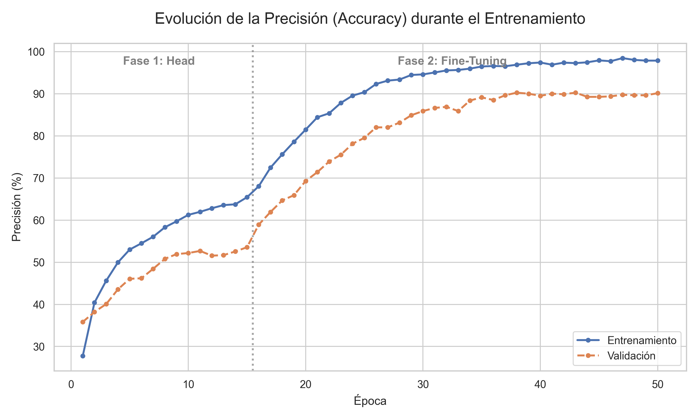
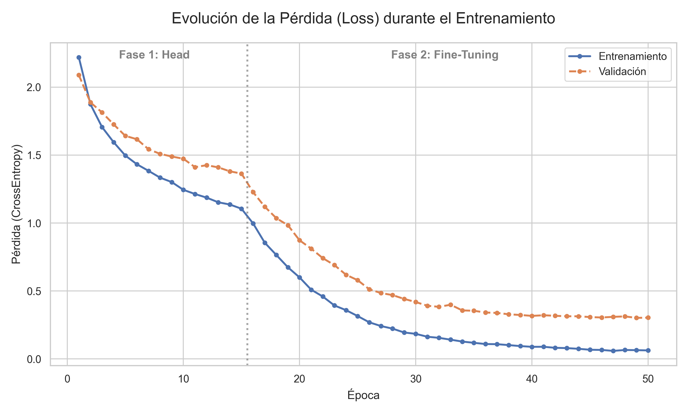

Las gráficas muestra un entrenamiento con un poco de **_Overfitting_** pero con un rendimiento general muy bueno, llegando a un *accuracy* y pérdida muy buenos mostrando que el entrenamiento ha sido exitoso. No obstante, se puede ver como al final de la gráfica ya la tendencia no es de crecimiento por lo que no parece que se pudieran obtener resultados mucho mejores con más épocas.

En cuanto a la evaluación del modelo total y la matriz de confusión, los datos obtenidos del modelo son los siguientes:

### **Resultados de la evaluación (Test Conv-1)**

| Clase | Precision | Recall | F1-score | Support |
|:-----:|:---------:|:------:|:--------:|:-------:|
| 0  | 0.94 | 0.90 | 0.92 | 69 |
| 1  | 0.90 | 0.95 | 0.92 | 56 |
| 2  | 0.78 | 0.78 | 0.78 | 41 |
| 3  | 0.92 | 0.60 | 0.73 | 20 |
| 4  | 0.74 | 0.74 | 0.74 | 35 |
| 5  | 0.96 | 0.96 | 0.96 | 45 |
| 6  | 0.89 | 0.89 | 0.89 | 56 |
| 7  | 0.83 | 0.94 | 0.88 | 47 |
| 8  | 0.90 | 0.80 | 0.85 | 45 |
| 9  | 0.73 | 0.74 | 0.74 | 43 |
| 10 | 0.78 | 0.85 | 0.82 | 47 |
| 11 | 0.85 | 0.95 | 0.90 | 55 |
| 12 | 0.72 | 0.60 | 0.65 | 30 |
| 13 | 0.96 | 0.96 | 0.96 | 47 |
| **Accuracy** | — | — | **0.86** | **636** |
| **Macro avg** | 0.85 | 0.83 | 0.84 | 636 |
| **Weighted avg** | 0.86 | 0.86 | 0.86 | 636 |

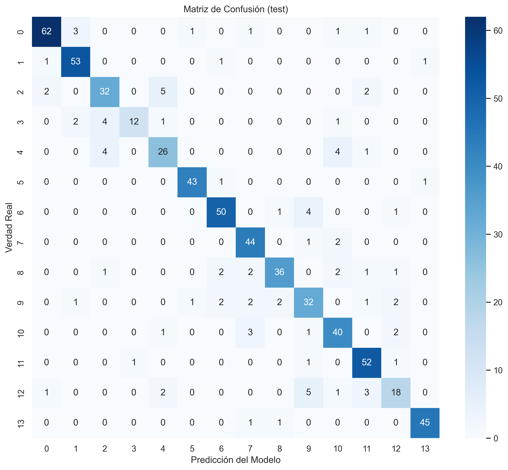

Los resultados de la red convolucional usando *Transfer Learning* dan a ver que se consigue mucho rendimiento utilizando esta técnica.

En cuanto a la [segunda red neuronal convolucional](./Network_Convolutional/Network_Convolutional2.ipynb), en esta no se usa *Transfer Learning* y es necesario entrenar todo desde 0.

Para el entrenamiento, en cuanto a la creación de la definición de la arquitectura de dicha red neuronal se define a partir del siguiente código:

```python
class SmartCNN(nn.Module):
    def __init__(self, num_classes=14):
        super(SmartCNN, self).__init__()
        
        # Bloques Convolucionales para extraer características
        self.conv1 = nn.Conv2d(3, 32, kernel_size=3, padding=1)
        self.bn1 = nn.BatchNorm2d(32)   # Normaliza los lotes para mejorar el orden de la red
        self.pool = nn.MaxPool2d(2, 2)
        
        self.conv2 = nn.Conv2d(32, 64, kernel_size=3, padding=1)
        self.bn2 = nn.BatchNorm2d(64)
        
        self.conv3 = nn.Conv2d(64, 128, kernel_size=3, padding=1)
        self.bn3 = nn.BatchNorm2d(128)
        
        self.conv4 = nn.Conv2d(128, 256, kernel_size=3, padding=1)
        self.bn4 = nn.BatchNorm2d(256)
        
        self.conv5 = nn.Conv2d(256, 512, kernel_size=3, padding=1)
        self.bn5 = nn.BatchNorm2d(512)
        
        # AdaptiveAvgPool2d((1, 1)) fuerza la salida a ser 1x1 espacialmente sin importar el tamaño de entrada.
        # Convierte (Batch, 512, 13, 13) -> (Batch, 512, 1, 1)
        self.global_pool = nn.AdaptiveAvgPool2d((1, 1))
        
        # Entrada de 512 debido a la última capa convolucional
        self.fc1 = nn.Linear(512, 256) 
        self.dropout = nn.Dropout(0.4)
        self.fc2 = nn.Linear(256, num_classes)

    def forward(self, x):
        # Extracción de características
        x = self.pool(F.relu(self.bn1(self.conv1(x))))
        x = self.pool(F.relu(self.bn2(self.conv2(x))))
        x = self.pool(F.relu(self.bn3(self.conv3(x))))
        x = self.pool(F.relu(self.bn4(self.conv4(x))))
        x = self.pool(F.relu(self.bn5(self.conv5(x))))
        
        # Pooling Global
        x = self.global_pool(x)
        
        # Aplanar: (Batch, 512, 1, 1) -> (Batch, 512)
        x = x.view(x.size(0), -1) 
        
        # Clasificación
        x = F.relu(self.fc1(x))
        x = self.dropout(x)
        x = self.fc2(x)
        
        return x

def create_model(num_classes=14):
    model = SmartCNN(num_classes=num_classes)
    print("Modelo SmartCNN (con GAP) creado.")
    return model
```

Las diferentes característica de la definición de la arquitectura son:

- `Conv2d`: Es la convolución que escanea la imagen buscando patrones, empieza con 32 filtros (bordes simples) y termina con 512 filtros (conceptos complejos).

- `BatchNorm2d`: Normaliza los datos después de cada convolución y es vital cuando se entrena desde cero porque evita que la red se desestabilice permitiendo así que aprenda mucho más rápido.

- `MaxPool2d`: Reduce el tamaño de la imagen a la mitad en cada paso.

- `nn.AdaptativeAvgPool2d`: Como la última capa tiene tantos valores, haciendo uso de este método se calcula el promedio de todos los pixeles y los convierte en un solo número 1x1 (Para más información véase: [AdaptativeAvgPool2d, PyTorch](https://docs.pytorch.org/docs/stable/generated/torch.nn.AdaptiveAvgPool2d.html))

Además, se ha activado un *dropout* del 40% para intentar evitar demasiado *overfitting*.

En cuanto al bucle de entrenamiento, se vuelve al método de un entrenamiento monolítico con las 50 épocas juntas y sin diferenciar entre las dos etapas usadas en la CNN anterior. Las característica del entrenamiento son:

- **_Scheduler_** (`ReduceLROnPlateau`): Si la red se estanca, reduce la velocidad de aprendizaje, cosa que es útil para afinar los detalles finales.

- **_Early Stopping_**: Si pasan 10 épocas sin mejora se detiene el entrenamiento para no perder tiempo.

Las gráficas obtenidas a partir del entrenamiento anterior son las siguientes:

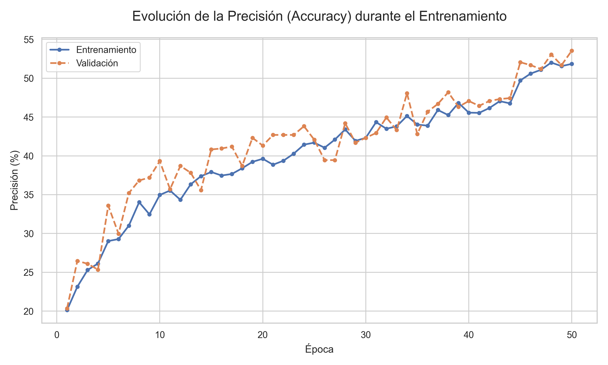
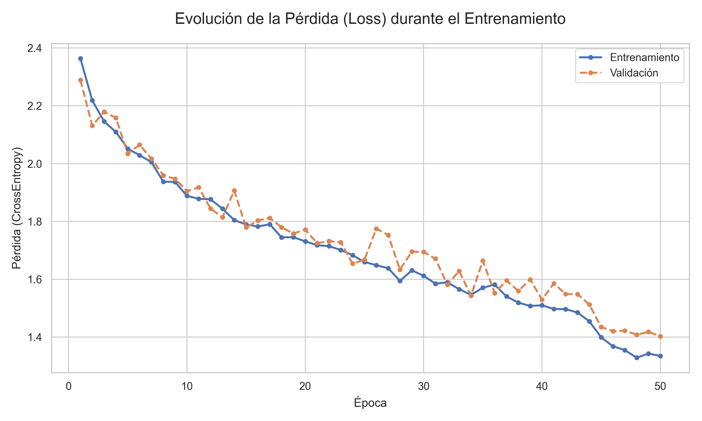

En las gráficas se puede apreciar como el entrenamiento se ha hecho de manera muy sólida y que la tendencia de la gráfica sigue aumentando en calidad por lo que se deduce que con más épocas seguiría mejorando mucho el rendimiento.

En cuanto a la evaluación de la red y su matriz de confusión:

### Resultados de la evaluación (Test)

| Clase | Precision | Recall | F1-score | Support |
|:-----:|:---------:|:------:|:--------:|:-------:|
| 0  | 0.73 | 0.70 | 0.71 | 69 |
| 1  | 0.55 | 0.75 | 0.64 | 56 |
| 2  | 0.38 | 0.34 | 0.36 | 41 |
| 3  | 0.42 | 0.25 | 0.31 | 20 |
| 4  | 0.46 | 0.49 | 0.47 | 35 |
| 5  | 0.72 | 0.96 | 0.82 | 45 |
| 6  | 0.32 | 0.41 | 0.36 | 56 |
| 7  | 0.52 | 0.49 | 0.51 | 47 |
| 8  | 0.63 | 0.27 | 0.38 | 45 |
| 9  | 0.51 | 0.42 | 0.46 | 43 |
| 10 | 0.50 | 0.43 | 0.46 | 47 |
| 11 | 0.38 | 0.58 | 0.46 | 55 |
| 12 | 0.54 | 0.23 | 0.33 | 30 |
| 13 | 0.95 | 0.81 | 0.87 | 47 |
| **Accuracy** | — | — | **0.54** | **636** |
| **Macro avg** | 0.54 | 0.51 | 0.51 | 636 |
| **Weighted avg** | 0.55 | 0.54 | 0.53 | 636 |

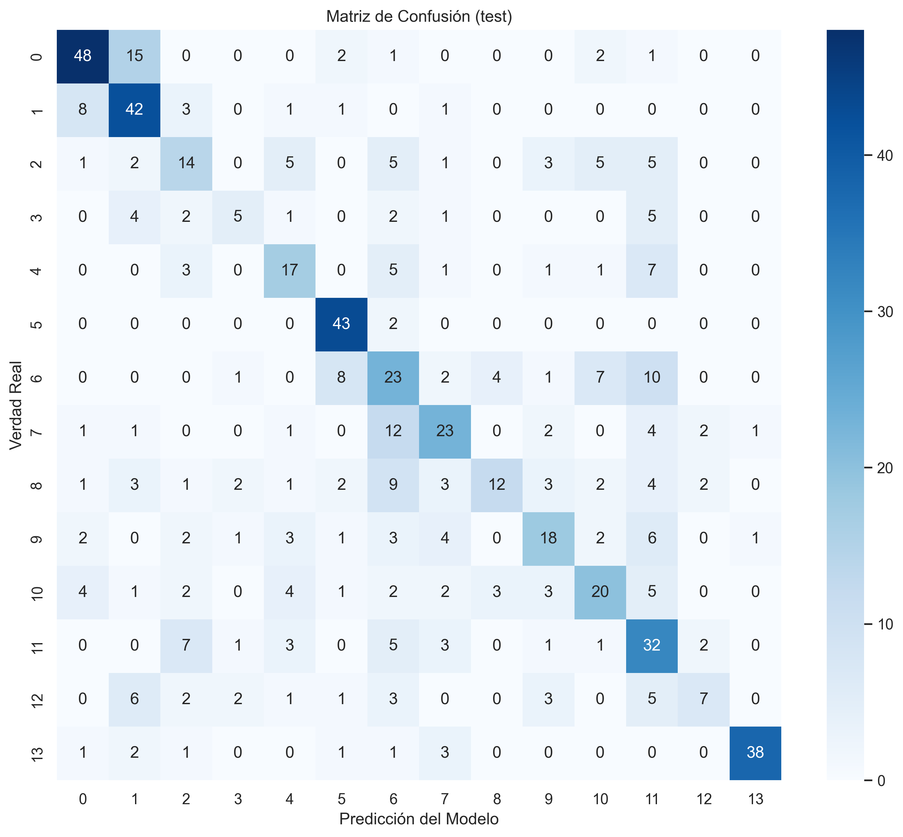

Si bien es cierto que los resultados apreciables en esta CNN no distan mucho de los obtenidos por la mejor red neuronal simple, la gráfica y la tendencia a diferencia de dicha red es seguir mejorando con el tiempo, por lo que aunque las gráficas sean parecidas, el potencial de mejora de la CNN es mucho mayor al de las redes simples las cuáles al final de las 50 épocas ya se encontraban estancadas.

Entre las dos CNNs creadas, además de las diferencias de rendimiento cabe mencionar que cada una tiene un tipo de uso estandarizado en donde son más eficaces que en otros ámbitos.

Resumen Comparativo entren la **SmartCNN** y la **ResNet** con *Transfer Learning*:

| Característica | SmartCNN | ResNet50 |
| :--: | :--: | :--: |
| **Origen** | Creada desde cero (Tabula Rasa). | Pre-entrenada con *ImageNet*. |
| **Peso del archivo** | Muy ligero (~5MB - 20MB). | Pesado (~100MB+). |
| **Datos necesarios** | Requiere **muchas** imágenes para aprender bien. | Funciona genial con **pocas** imágenes. |
| **Tiempo de entreno** | Rápido por época (menos capas), pero necesita muchas épocas. | Lento por época (red gigante), pero converge en pocas épocas. |
| **Uso ideal** | Cuando se tienen millones de datos o una tarea muy específica (ej. imágenes médicas, satélite) que no se parecen a las fotos normales. | La opción por defecto para casi cualquier tarea de visión artificial estándar. |

Las gráficas de comparación entre las redes neuronales quedan tal que:


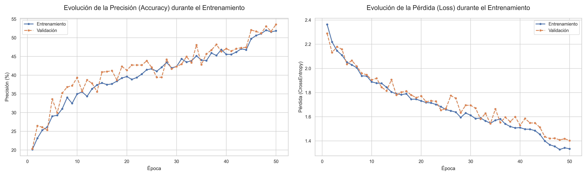

## DETECTOR DE YOLO CON PRUEBAS EN VÍDEO

Como parte adicional al proyecto se ha decidido entrenar una red neuronal con YOLO para detectar las clases en un vídeo que venía dentro del DataSet utilizado durante todo el proyecto, dicho vídeo se puede encontrar dentro del proyecto *clickando* en el [enlace](./Network_YOLO/Resources/test.mp4).

Para esta parte del proyecto se ha hecho uso del modelo [YOLO-11](https://docs.ultralytics.com/es/models/yolo11/) de ultralytics.

Cabe mencionar que para el correcto funcionamiento del entrenamiento es necesario el fichero de definición .yaml con toda la información necesaria. Dicho fichero ([data.yaml](./Network_YOLO/data.yaml)) contiene lo siguiente:

```yaml
train: C:/Users/ivanp/Desktop/traffic_signals_without_10/TGC_RBNW/train/images
val: C:/Users/ivanp/Desktop/traffic_signals_without_10/TGC_RBNW/valid/images
test: C:/Users/ivanp/Desktop/traffic_signals_without_10/TGC_RBNW/test/images

nc: 14
names: [
  'Green Light', 'Red Light', 'Speed Limit 100', 'Speed Limit 110',
  'Speed Limit 120', 'Speed Limit 20', 'Speed Limit 30', 'Speed Limit 40',
  'Speed Limit 50', 'Speed Limit 60', 'Speed Limit 70', 'Speed Limit 80',
  'Speed Limit 90', 'Stop'
]
```

El entrenamiento en sí del detector es el siguiente:

```python
# === ENTRENAMIENTO DEL MODELO ===
print("Iniciando entrenamiento del modelo")
model = YOLO("yolo11m.pt")

results = model.train(
    data="data.yaml",               # Ruta al archivo de configuración de datos
    imgsz=640,                      # Tamaño de las imágenes (Se reescalan para más eficiencia)
    epochs=50,                      # Número de épocas de entrenamiento
    project="runs/train_custom",    # Directorio donde se guardarán los resultados
    name="exp1",                    # Nombre del entrenamiento
    exist_ok=True,                  # Sobrescribir si el directorio ya existe
    plots=True                      # Generar gráficos de métricas durante el entrenamiento
)
print("Entrenamiento completado.")
```

Una vez entrenado el detector se aplica en cada frame del vídeo para obtener un output con el vídeo procesado.

### **Vídeo procesado con el detector**

[](https://www.youtube.com/watch?v=RAZaADUnYSg)

### **CANCIÓN**

Adicionalmente, se ha creado una [canción](./Network_YOLO/YOLO.mp3) con Suno AI:
- https://drive.google.com/file/d/1I_AofIVKEJFz1Ctkm6tKBoN2TtxnousO/view?usp=sharing

<div style="margin-left: 8ch;">

Me voy a descargar este dataset de kaggle,  
que tiene imágenes de 15 clases de señales.  
Yolo, Yolo, Yolo.  
Y cuando voy a ver que hay en cada carpeta,  
me fijo en el formato que tienen las etiquetas.  
Yolo, Yolo, Yolo.  

Uooooooooooo  
qué lento entrena la red neuronal,  
sí poooooooongo  
un valor bajo de learning rate.  

Añado luego alguna capa convolucional,  
para lograr la precisión que me haga aprobar.  
Yolo, Yolo, Yolo.  
Y como aún me está saliendo un porcentaje bajo,  
intento usar ahora un modelo pre entrenado.  
Yolo, Yolo, Yolo.  

Uooooooooooo  
qué lento entrena la red neuronal,  
sí poooooooongo  
un valor bajo de learning rate.
</div>

## FUENTES Y DOCUMENTACIÓN

- **Internet:** Se ha utilizado a la largo del proyecto para obtener información y leer la documentación oficial de **PyTorch** además de **Kaggle** para encontrar el DataSet con el que se ha trabajado.

- **Inteligencia Artificial Generativa (ChatGPT, Gemini):** Se ha utilizado la IA para transformar algunas de las tablas generadas en el código a formato *Markdown* para el **README.md**, así como para realizar algunas preguntas sobre eficiencia en el entrenamiento de las propias redes neuronales.

- **Enlaces:**

    - https://drive.google.com
    - https://www.kaggle.com
    - https://pytorch.org
    - https://docs.ultralytics.com/es/
    - https://suno.com/home
    - https://chatgpt.com/
    - https://youtube.com/
    - https://gemini.google.com

<h4 style="text-weight: bold">Correo de contacto: ivanperezdiaz829@gmail.com</h4>
