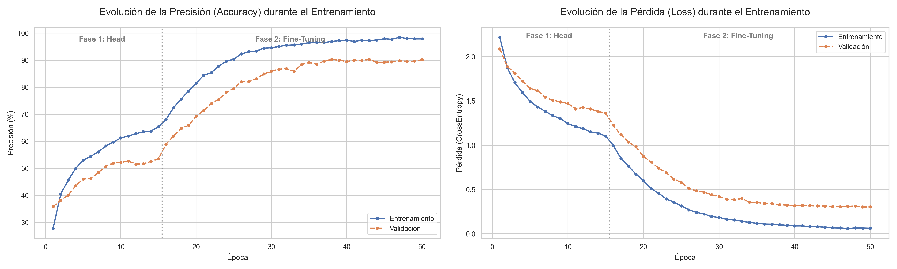

# **NEURONAL NETWORKS**

## ÍNDICE

- [Descripción del Proyecto](#descripción-del-proyecto)
- [Estructura del Repositorio](#estructura-del-repositorio)
- [DataSet y Características](#dataset-y-características)
- [Preparación del Entorno](#preparación-del-entorno)
- [Comparativa entre Redes Simples](#comparativa-entre-redes-simples)
- Comparativa de Redes Convolucionales.
- Detector de YOLO con pruebas en vídeo.

## DESCRIPCIÓN DEL PROYECTO

El proyecto consiste en la **creación y posterior comparación** entre diferentes redes neuronales de diferentes tipos con el objetivo de llevar a cabo la clasificación de un grupo de imágenes obtenidas a partir de un DataSet de señales de tráfico extraído de **Kaggle** ([pkdarabi/cardetection](https://www.kaggle.com/datasets/pkdarabi/cardetection)).

Se busca **comparar el rendimiento y desempeño** entre dos **redes neuronales simples** diferentes, además de comparar dos **CNNs** (*Convolutional Neural Networs*, Redes neuronales convolucionales) diferentes entre ellas y finalmente, comparar ambos tipos de redes para obtener una vista general y poder **sacar conclusiones al respecto**.

Como **última sección del proyecto**, se dispondrá de una Red entrenada haciendo uso del detector de imágenes [YOLO](https://docs.ultralytics.com/es/) con las mismas clases que se han entrenado los clasificadores anteriormente mencionados, esto es para obtener un resultado visual de detección de imagen en un vídeo con las clases de los clasificadores (*Computer Vision*) aunque sin uso más allá en la comparativa anteriormente mencionada entre los clasificadores basados en las redes simples y las CNNs.

Con el fin de mantener un **entorno controlado y equitativo** para los entrenamientos de las redes neuronales, se ha decidido entrenar todas las redes con la misma tarjeta gráfica, así como la misma cantidad de épocas de entrenamiento que se ha fijado a **50 épocas totales** (aunque se aplica *early stopping* por si se suceden muchas épocas sin mejora).

## ESTRUCTURA DEL REPOSITORIO

La estructura del repositorio consta de **1 carpeta raíz con los CSVs** (*Comma-Separated Values*) de los datos a usar, además de otras 3 carpetas principales que contienen el código de entrenamiento de las **Redes Neuronales** con sus correspondientes carpetas de resultados y utilidades:

Carpeta **CSVs** con sus contenidos:
```raw
> CSVs
    - labels_test.csv
    - labels_train.csv
    - labels_valid.csv
    - test_corregido.csv
    - train_corregido.csv
    - valid_corregido.csv
```

Carpeta **Network_Convolutional** con sus contenidos:
```raw
> Network_Convolutional
    > results
        - grafica_accuracy_custom.png
        - grafica_accuracy.png
        - grafica_juntos_custom.png
        - grafica_juntos.png
        - grafica_loss_custom.png
        - grafica_loss.png
        - matriz_confusion_custom.png
        - matriz_confusion.png
        - training_history_custom.csv
        - training_history.csv
        - (Entrenamientos .pth no subidos al repo para ahorrar espacio)
    - Network_Convolutional.ipynb
    - Network_Convolutional2.ipynb
```

Carpeta **Network_Simple** con sus contenidos:
```raw
> Network_Simple
    > results
        - grafica_accuracy_simple1.png
        - grafica_accuracy_simple2.png
        - grafica_loss_simple1.png
        - grafica_loss_simple2.png
        - matriz_confusion_simple1.png
        - matriz.confusion_simple2.png
        - training_history_simple1.csv
        - training_history_simple2.csv
        - (Entrenamientos .pth no subidos al repo para ahorrar espacio)
    - Network_Simple.ipynb
    - Network_Simple2.ipynb
```

Carpeta **Network_YOLO** con sus contenidos:
```raw
> Network_YOLO
    > outputs
        - tracking_result_YOLO.mp4
    > Resources
        - test.mp4
    > runs
        > detect
            > val
                - BoxF1_curve.png
                - BoxP_curve.png
                - BoxPR_curve.png
                - BoxR_curve.png
                - confusion_matrix_normalized.png
                - confusion_matrix.png
                - predictions.json
                - (Valores de labels en los batch)
        > train_custom
            > exp1
                > weights
                    - best.pt
                    - last.pt
                - args.yaml
                - BoxF1_curve.png
                - BoxP_curve.png
                - BoxPR_curve.png
                - BoxR_curve.png
                - confusion_matrix_normalized.png
                - confusion_matrix.png
                - labels.jpg
                - results.csv
                - results.png
                - (Valores de labels en los batch)
    - data.yaml
    - tracking_results.csv
    - YOLO_Network.ipynb
    - YOLO.mp3
    - yolo11m.pt
```

## DATASET Y CARACTERÍSTICAS

Con el propósito de entrenar las redes neuronales se ha hecho uso, como se mencionó en la [descripción del proyecto](#descripción-del-proyecto) de un DataSet sacado directamente de Kaggle, dicho dataset está preparado para su uso en tareas de *Computer Vision* haciendo uso de [YOLO](https://docs.ultralytics.com/es/) (Véase [Detector de YOLO con pruebas en vídeo](#detector-de-yolo-con-pruebas-en-vídeo)). El DataSet a utilizar es el siguiente:

- https://www.kaggle.com/datasets/pkdarabi/cardetection

El mencionado DataSet cuenta con 3 directorios llamados train, test y valid y cada uno de ellos posee una carpeta para las imágenes y otra para los *labels* en [formato YOLO](https://docs.ultralytics.com/datasets/detect/) y con un total de 15 clases:

- **Green Light** 
- **Red Light** 
- **Speed Limit 10** -> Esta se elimina (Véase [Preparación del Entorno](#preparación-del-entorno))
- **Speed Limit 100**
- **Speed Limit 110**
- **Speed Limit 120**
- **Speed Limit 20**
- **Speed Limit 30**
- **Speed Limit 40**
- **Speed Limit 50**
- **Speed Limit 60**
- **Speed Limit 70**
- **Speed Limit 80**
- **Speed Limit 90**
- **Stop**

Las **imágenes del DataSet** cuentan con un tamaño de **416x416 píxeles** y con una división de imágenes dentro de sus carpetas correspondientes y de manera total que se puede observar en la siguiente tabla:

| Label | Test Images | Train Images | Valid Images | Total Images |
| :---: | :---------: | :----------: | :----------: | :----------: |
|   0   |     110     |     542      |      122     |      774     |
|   1   |      94     |     585      |      108     |      787     |
|   2   |       3     |      19      |      0       |      22      |
|   3   |      46     |     267      |      52      |      365     |
|   4   |      21     |     101      |      17      |      139     |
|   5   |      44     |     252      |      60      |      356     |
|   6   |      46     |     285      |      56      |      387     |
|   7   |      60     |     334      |      74      |      468     |
|   8   |      53     |     235      |      55      |      343     |
|   9   |      50     |     283      |      71      |      404     |
|  10   |      45     |     301      |      76      |      422     |
|  11   |      53     |     318      |      78      |      449     |
|  12   |      61     |     323      |      56      |      440     |
|  13   |      34     |     168      |      38      |      240     |
|  14   |      50     |     285      |      81      |      416     |


## PREPARACIÓN DEL ENTORNO

Para la realización del proyecto, primeramente se han de descargar una serie de paquetes, requisitos y dependencias, para ello, y con el propósito de aislar las descargas y por consiguiente evitar incompatibilidades con otros paquetes, se ejecuta el siguiente **Script** desde **Anaconda Prompt** para la creación de un *environment* especializado para el proyecto.

```bash
# Creación del environment de Anaconda
conda create --name NN python=3.11.5
conda activate NN

# Para entrenar con GPU NVIDIA
pip install torch torchvision torchaudio --index-url https://download.pytorch.org/whl/cu121

# Resto de dependencias del proyecto
pip install pandas 
pip install numpy
pip install matplotlib 
pip install seaborn
pip install scikit-learn
pip install tqdm
pip install pillow
pip install kagglehub
pip install lapx
pip install ultralytics
```

De manera adicional, **se han de tratar los datos del DataSet** descargado dado que la clase de **índice 2 tiene muy pocas imágenes**, incluso no teniendo ninguna imagen dentro del conjunto de imagenes de validación lo que **ocasiona problemas** durante el entrenamiento y genera confusión, empeorando así el desempeño de las propias redes neuronales.

Para limpiar la clase en cuestión, el repositorio cuenta con un documento en la raíz llamado `new_csv.py`que contiene el siguiente **Script** de borrado:

```python
import csv

def procesar_csv(archivo_entrada, archivo_salida):
    print(f"\n--- Iniciando procesamiento de: '{archivo_entrada}' ---")   
    filas_eliminadas = 0
    filas_modificadas = 0
    filas_totales_escritas = 0

    try:
        with open(archivo_entrada, mode='r', newline='') as infile, \
             open(archivo_salida, mode='w', newline='') as outfile:
            reader = csv.reader(infile)
            writer = csv.writer(outfile)

            try:
                header = next(reader)
                writer.writerow(header)
            except StopIteration:
                print(f"Error: El archivo '{archivo_entrada}' está vacío.")
                return

            for row in reader:
                if not row:
                    continue
                try:
                    clase_index = int(row[1])                 
                    if clase_index == 2:
                        filas_eliminadas += 1
                        continue
                    elif clase_index > 2:
                        clase_index -= 1
                        filas_modificadas += 1
                        row[1] = str(clase_index) 
                    writer.writerow(row)
                    filas_totales_escritas += 1

                except ValueError:
                    print(f"Advertencia: Se omitió una fila mal formada (índice no numérico): {row}")
                except IndexError:
                    print(f"Advertencia: Se omitió una fila mal formada (faltan columnas): {row}")

        print(f"Resultados guardados en: '{archivo_salida}'")
        print(f"Filas eliminadas: {filas_eliminadas}")
        print(f"Filas re-mapeadas: {filas_modificadas}")
        print(f"Total de filas escritas: {filas_totales_escritas}")

    except FileNotFoundError:
        print(f"Error: No se encontró el archivo de entrada '{archivo_entrada}'.")
    except Exception as e:
        print(f"Ocurrió un error inesperado con '{archivo_entrada}': {e}")

archivos_a_procesar = [
    ('./CSVs/labels_train.csv', './CSVs/train_corregido.csv'),
    ('./CSVs/labels_valid.csv', './CSVs/valid_corregido.csv'),
    ('./CSVs/labels_test.csv', './CSVs/test_corregido.csv')
]
print("Iniciando el procesamiento de todos los archivos...")

for entrada, salida in archivos_a_procesar:
    procesar_csv(entrada, salida)

print("\n--- ¡Proceso de todos los archivos completado! ---")
```
Adicionalmente y por simplicidad, se ha decidido agregar el anterior **Script** a cada uno de los *Jupyter Notebooks* de cada red neuronal.

Tras el **Script** de limpiado, el estado del DataSet con el que se va a trabajar es el siguiente:

| Label | Test Images | Train Images | Valid Images | Total Images |
| :---: | :---------: | :----------: | :----------: | :----------: |
|   0   |     110     |      542     |      122     |      774     |
|   1   |      94     |      585     |      108     |      787     |
|   2   |      46     |      267     |      52      |      365     |
|   3   |      21     |      101     |      17      |      139     |
|   4   |      44     |      252     |      60      |      356     |
|   5   |      46     |      285     |      56      |      387     |
|   6   |      60     |      334     |      74      |      468     |
|   7   |      53     |      235     |      55      |      343     |
|   8   |      50     |      283     |      71      |      404     |
|   9   |      45     |      301     |      76      |      422     |
|   10  |      53     |      318     |      78      |      449     |
|   11  |      61     |      323     |      56      |      440     |
|   12  |      34     |      168     |      38      |      240     |
|   13  |      50     |      285     |      81      |      416     |

Nótese que ahora hay **una fila menos**, esto es porque el **Script** borra el rastro de la anterior clase de índice 2 y reestructura todos los datos para que los *labels* estén ordenados.

## COMPARATIVA ENTRE REDES SIMPLES

Se han creado 2 redes Simples haciendo uso de *[PyTorch](https://pytorch.org)* con sus respectivas cualidades y características para comprobar la variación en la calidad de las mismas.

La primera de las Redes Neuronales Simples ([Network_Simple.ipynb](./Network_Simple/Network_Simple.ipynb)) aplica el siguiente tratado de imágenes:

- Se define el tamaño de las imágenes: **416x416 píxeles**.

- Se convierten las imágenes de entrenamiento a **escala de grises** pero se mantienen los 3 canales de salida para que el formato numérico sea **idéntico a una imagen a color** y luego se **normaliza el valor** de los píxeles entre -1 y 1.

- La transformación de las imágenes de validación solo redimensiona y normaliza sin pasar a escala de grises.

En cuanto a la clase DataSet (necesaria para entrenar redes con *[PyTorch](https://pytorch.org)*) realiza lo siguiente:

- Busca la imagen en el disco.
- Si la imagen está corrupta, devuelve una imagen negra para evitar que el entrenamiento falle.
- Busca la etiqueta (clase) en el DataFrame agrupado.
- Aplica las transformaciones y devuelve el par `(imagen, etiqueta)`.

A continuación y en otro fragmento, se aplica al conjunto de datos la modificación de los datos mencionados antes en el **Script** de eliminación de la clase de índice 2 (Véase [Preaparación del Entorno](#preparación-del-entorno) y/o el [Script](new_csv.py)).

Con los preparativos previos, la definición del **Modelo SimpleNN** que define el cerebro artificial de la arquitectura queda de la siguiente manera:

```python
# === FRAGMENTO 4 ===
class SimpleNN(nn.Module):
    def __init__(self, num_classes=14):
        super(SimpleNN, self).__init__()
        
        # Cálculo automático del tamaño aplanado
        self.flatten_size = 3 * 416 * 416 
        
        # Arquitectura Piramidal (Reduciendo progresivamente)
        self.fc1 = nn.Linear(self.flatten_size, 512) 
        self.bn1 = nn.BatchNorm1d(512) # BatchNorm ayuda mucho en redes simples profundas
        
        self.fc2 = nn.Linear(512, 256)
        self.bn2 = nn.BatchNorm1d(256)
        
        self.fc3 = nn.Linear(256, 128)
        self.bn3 = nn.BatchNorm1d(128)
        
        self.out = nn.Linear(128, num_classes)
        
        self.dropout = nn.Dropout(0.5) # Dropout para evitar memorización

    def forward(self, x):
        # Aplanar
        x = x.view(x.size(0), -1) 
        
        # Capa 1
        x = F.relu(self.bn1(self.fc1(x)))
        x = self.dropout(x)
        
        # Capa 2
        x = F.relu(self.bn2(self.fc2(x)))
        x = self.dropout(x)
        
        # Capa 3
        x = F.relu(self.bn3(self.fc3(x)))
        
        # Salida
        x = self.out(x)
        return x

def create_simple_model(num_classes=14):
    model = SimpleNN(num_classes=num_classes)
    print(f"Modelo SimpleNN (416x416) creado.")
    print(f"Neuronas de entrada: {model.flatten_size}")
    return model
```

Las cualidades de la red que define el fragmento de código anterior son las siguientes:

- **Tipo de Red:** La Red es un **Perceptrón Multicapa** (MLP) o Red Neuronal Densa.

- Cálculo de neuronas de entrada: se realiza un `self.flatten_size`para calcular el número de neuronas de entradas son necesarias siguiendo el siguiente cálculo:

    $$
    \text{Neuronas Entrada} = \text{3 canales} \times (416*416)
    $$

- Número de capas embudo: La arquitectura va comprimiendo el número de neuronas en sucesivas capas:

    - **Entrada masiva de datos:** Empieza con aproximadamente 519k neuronas.
    - **Capa 1:** Se reduce el número de neuronas de manera drástica a 512.
    - **Capa 2:** Se reduce a 256 neuronas.
    - **Capa 3:** Se reduce a 128 neuronas.
    - **Salida:** Salen 14 neuronas (una por cada clase definida por el conjunto de datos).

- Entre cada una de las capas embudo se aplica también una regularización con dos valores importantes:

    - `BatchNorm1d`: Normaliza los datos dentro de la red para estabilizar el aprendizaje.
    - `Dropout(0.5)`: Apaga aleatoriamente el 50% de las neuronas durante el entrenamiento para evitar un **_overfitting_** (memorización) muy brusco por parte de la red.

- La última parte relevante a comentar en la definición de la arquitectura de la red neuronal es el método `forward`, que aunque no pertenece a la arquitectura en sí, es necesaria dado que realiza lo siguiente:

    - Se realiza un proceso de **_flattening_** o aplanamiento en el que entra un Batch (lote) de imágenes que **PyTorch** ve como un tensor 4D dado a que en las redes neuronales "densas" como la que se ha creado no existe una tendencia a lo ancho o a lo alto sino que solo entienden de listas largas de números. Esta línea aplana las dimensiones de la imagen

    - A cada capa se aplica una función de activación no lineal (ReLu) que convierte todos los números negativos en 0 deja pasar a los positivos permitiendo a la red aprender formas complejas y no solo las líneas rectas.

    - La salida NO tiene una función *Softmax*, se queda como números crudos (negativos o positivos) porque más adelante se usa `nn.CrossEntropyLoss` que aplica de manera interna un *Softmax* por lo que, si se pone el *Softmax* en esta salida se rompería el entrenamiento más adelante.

Una vez creada la definición de la arquitectura, se busca el *device* disponible para intentar usar una gráfica CUDA si la hubiese, y posteriormente se muestra el *summary* del modelo cargado en el dispositivo:

```raw
--- Usando GPU: NVIDIA GeForce RTX 3060 Ti ---

----------------------------------------------------------------
        Layer (type)               Output Shape         Param #
================================================================
            Linear-1                  [-1, 512]     265,814,528
       BatchNorm1d-2                  [-1, 512]           1,024
           Dropout-3                  [-1, 512]               0
            Linear-4                  [-1, 256]         131,328
       BatchNorm1d-5                  [-1, 256]             512
           Dropout-6                  [-1, 256]               0
            Linear-7                  [-1, 128]          32,896
       BatchNorm1d-8                  [-1, 128]             256
            Linear-9                   [-1, 14]           1,806
================================================================
Total params: 265,982,350
Trainable params: 265,982,350
Non-trainable params: 0
----------------------------------------------------------------
Input size (MB): 1.98
Forward/backward pass size (MB): 0.02
Params size (MB): 1014.64
Estimated Total Size (MB): 1016.64
----------------------------------------------------------------
```

Tras todo lo anterior, se empieza con el bucle de entrenamiento. Como se ha mencionado anteriormente, todos los entrenamientos realizados han ejecutado exactamente 50 épocas, en el caso del entrenamiento de esta red simple.

Los hiperparámetros han sido:

- **50 épocas** (aunque puede parar antes por la paciencia)
- **_Learning Rate_** (Tasa de aprendizaje) del 0.001.
- **Paciencia** de 10 épocas para detener el entrenamiento en caso de no haber mejora.

El Optimizador y la función de pérdida:

- `CrossEntropyLoss`: La fórmula estándar para medir el error en clasificación múltiple (Para más información véase: [CrossEntropyLoss, PyTorch](https://docs.pytorch.org/docs/stable/generated/torch.nn.CrossEntropyLoss.html)).
- `Adam`: El algoritmo que actualiza los pesos de la red para reducir el error (Para más información véase: [Adam, PyTorch](https://docs.pytorch.org/docs/stable/generated/torch.optim.Adam.html))
- `ReduceLROnPlateau`: En el caso de que la red deje de mejorar, reduce el **_Learning Rate_** para intentar encontrar un mínimo más preciso (Para más información véase: [ReduceLROnPlateau, PyTorch](https://docs.pytorch.org/docs/stable/generated/torch.optim.lr_scheduler.ReduceLROnPlateau.html)). 

El bucle para cada época:

- Fase de *Train*: La red predice, calcula el error y hace backward (retroprogramación) para ajustar pesos.

- Fase de *Validation*: La red predice sobre datos que nunca ha visto sin aprender de ellos solo para medir su rendimiento real.

- **_Early Stopping_**: Si la precisión en la validación no mejora durante 10 épocas seguidas, el entrenamietno se detiene de manera prematura para ahorrar tiempo y evitar sobreajuste.

En cuanto a los resultados del entrenamiento, se guardan dentro de un CSV y después, haciendo uso de dichos datos, se reconstruye un gráfico de la función de pérdida y de la precisión obtenida tal que:



## TIPOS DE REDES NEURONALES:

<h4 style="text-decoration: underline; font-weight: bold">Simple Network:</h4>

<div style="margin-left: 8ch;">
Para el primer diseño hemos creado una red neuronal con dos capas ocultas (512 y 128 neuronas), y una capa de salida de 15 clases. Como función de activación hemos usado la sigmoide puesto que fue la que vimos en primer lugar en clase de teoría, y en la capa de salida aplicamos softmax. 
</div>


## DETECTOR DE YOLO CON PRUEBAS EN VÍDEO

## CANCIÓN:

A modo de resumen hemos escrito esta letra y generado una canción sobre la práctica con la ayuda de Suno AI:
- https://drive.google.com/file/d/1I_AofIVKEJFz1Ctkm6tKBoN2TtxnousO/view?usp=sharing

<div style="margin-left: 8ch;">

Me voy a descargar este dataset de kaggle,  
que tiene imágenes de 15 clases de señales.  
Yolo, Yolo, Yolo.  
Y cuando voy a ver que hay en cada carpeta,  
me fijo en el formato que tienen las etiquetas.  
Yolo, Yolo, Yolo.  

Uooooooooooo  
qué lento entrena la red neuronal,  
sí poooooooongo  
un valor bajo de learning rate.  

Añado luego alguna capa convolucional,  
para lograr la precisión que me haga aprobar.  
Yolo, Yolo, Yolo.  
Y como aún me está saliendo un porcentaje bajo,  
intento usar ahora un modelo pre entrenado.  
Yolo, Yolo, Yolo.  

Uooooooooooo  
qué lento entrena la red neuronal,  
sí poooooooongo  
un valor bajo de learning rate.
</div>
